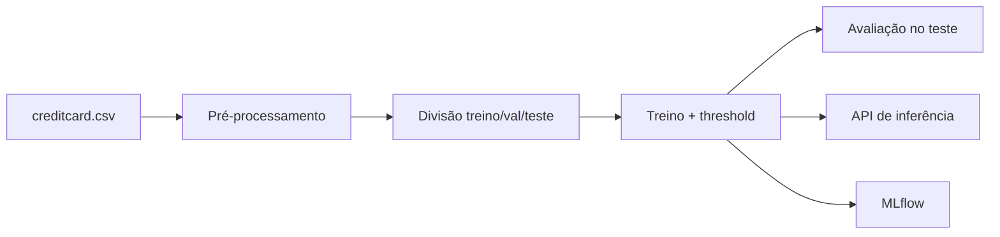

# MLOps — Detecção de Fraude

Sistema de detecção de fraude em transações de cartão de crédito, empacotado
como um projeto MLOps completo: pré-processamento reprodutível, modelagem em
dados fortemente desbalanceados, avaliação rigorosa, API de inferência,
rastreamento de experimentos e CI/CD.

## Visão geral

- **Domínio:** finanças / detecção de fraude.
- **Alvo:** `Class` — binário (1 = fraude, 0 = legítima).
- **Métrica principal:** PR-AUC (*Average Precision*). Sob ~0,17% de fraudes, a
  ROC-AUC é otimista demais; a PR-AUC foca no desempenho sobre a classe positiva.
- **Modelo principal:** XGBoost com `scale_pos_weight`; baseline de Regressão
  Logística. SMOTE disponível como alternativa.
- **Serving:** API FastAPI que valida cada requisição contra o schema de treino.

## Fluxo do pipeline

Comece pelos guias de [instalação](guia_instalacao.md) e [uso](guia_uso.md).
